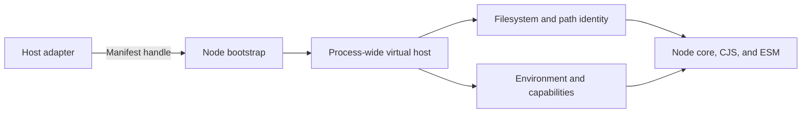

# RFC: Hermetic Node.js runtime

Status: proposed

## Summary

Add an opt-in Node.js runtime driven by an immutable execution manifest from a
trusted host adapter. The manifest defines the process's filesystem view,
environment, working directory, executable identity, inherited file
descriptors, and allowed capabilities.

Node loads the manifest before normal startup I/O and creates one process-wide
virtual host shared by the main thread, workers, and loaders. Node core remains
independent of any host. Build systems, containers, and standalone launchers
can provide adapters.

Here, hermetic means every Node-owned external input comes from the manifest.
Deterministic execution and native-code confinement are separate concerns.

## Motivation

Building Node from pinned sources does not make programs executed by Node
hermetic. The runtime can still read host files, discover global packages,
follow symlinks outside its input tree, or expose machine-specific paths.

Node's Permission Model is a useful base, but it is not sufficient as the
authority for a hermetic runtime. Filesystem grants are lexical, some startup
inputs are read before permissions are initialized, internal module stat calls
bypass permission checks, and workers do not share one immutable policy.

External launchers and JavaScript filesystem patches can hide part of this,
but they run too late and do not cover every Node-internal path.

## Goals

- Prevent Node-owned code from accessing undeclared files, including through
  symlinks.
- Give `node:fs`, CommonJS, ESM, workers, and loaders one logical filesystem.
- Keep module identities and user-visible paths stable across machines.
- Make the policy immutable and process-wide.
- Keep existing Node behavior when the mode is disabled.
- Keep the contract generic so different hosts can implement adapters.

## Non-goals

- Discovering dependencies for a host or build system.
- Making explicitly granted clocks, randomness, scheduling, or process identity
  deterministic.
- Sandboxing arbitrary native code without operating-system support.
- Changing the normal Node.js runtime.

## Design

### Execution manifest

The host starts Node with a CLI-only manifest handle. A descriptor or native
handle avoids an unguarded bootstrap path read and can refer to immutable data.
It cannot be supplied through `NODE_OPTIONS`, replaced by a worker, or widened
from JavaScript.

The versioned manifest contains:

- Virtual mounts and their backing handles.
- Exact read-only files and explicitly mounted subtrees.
- Writable output and temporary roots.
- Logical `cwd` and `process.execPath`.
- Environment variables and inherited descriptors.
- Host and process identity values exposed by `node:os` and `process`.
- Network, process, worker, addon, FFI, WASI, and inspector capabilities.
- Optional clock, entropy, locale, timezone, DNS, and certificate providers.

Node parses it before reading ambient environment settings, dotenv files,
configuration files, ICU, OpenSSL, or user code. The policy can only be
narrowed after startup.

### Virtual host

The virtual host separates authorization from path identity.

Authorization is operation-aware. Reads must use a declared logical path whose
backing object matches the manifest. Writes must remain under a writable mount,
including every parent component. Link operations distinguish inspecting a
link from following its target. Rename, copy, and link operations validate both
sides. Open file descriptors retain their capabilities, and unknown inherited
descriptors are rejected unless declared.

Physical containment alone is not enough. A host may intentionally map a
logical file to a content store elsewhere. That crossing is allowed only when
the manifest declares it.

Path identity controls what Node exposes. Physical paths are used for I/O but
logical paths are used for `realpath`, module caches, source maps, errors,
`__filename`, `import.meta.url`, `cwd`, and `process.execPath`.

Strict enforcement requires descriptor-relative traversal where the platform
supports it. On platforms without an equivalent primitive, strict mode also
requires an OS sandbox. This avoids making a path check that can race with a
later filesystem call.

### Node integration

The existing Permission Model continues to provide capability scopes, errors,
and audit events. The virtual host becomes authoritative for hermetic access.

The first implementation is split into focused patches:

1. Load and validate the process-wide policy before normal Node startup.
2. Route public and internal filesystem operations through the virtual host,
   including module stat, package reads, watchers, recursive copy, reports, and
   caches.
3. Give CommonJS and ESM one logical canonicalizer and stop package lookup at a
   virtual mount boundary.
4. Inherit the policy across workers and validate custom loader results after
   the complete hook chain.
5. Make environment, OpenSSL, ICU, DNS, home, temp, and global module lookup
   explicit inputs.
6. Add a strict runtime target that disables native escape surfaces by default.

Strict mode denies network access and the inspector unless the manifest grants
them. Workers may run only with the same or a narrower policy. Native addons,
FFI, and arbitrary child executables remain disabled unless the host also
provides OS isolation. A hermetic Node child may inherit the same or a narrower
policy. WASI may run only with preopens and descriptors derived from the
virtual host.

## Security boundary

The virtual host is intended to cover Node-owned access. It is not a substitute
for an operating-system sandbox.

An allowed native addon or FFI binding can issue direct syscalls or load
undeclared libraries. Arbitrary child executables have the same problem. Strict
mode must disable these surfaces unless the host also provides OS isolation.

Hosts running hostile code also need OS enforcement for mutable filesystem
races and direct system calls. On supported platforms this may use namespaces,
Landlock, seccomp, Seatbelt, AppContainer, or equivalent isolation.

## Rollout

Start with audit mode. Report undeclared access, ambient inputs, and physical
path leaks without changing behavior.

Next, enable filesystem enforcement and shared CJS/ESM identity in an
experimental runtime. Validate symlinks, descriptors, workers, loader hooks,
package lookup, writable mounts, and Windows reparse points.

After the manifest and error behavior settle, publish the strict runtime and
adapter guidance. The ordinary Node target remains unchanged throughout.

## Open questions

- What wire format and versioning rules should the manifest use?
- Which filesystem metadata should be virtualized or normalized?
- Should denials use `ERR_ACCESS_DENIED` or a distinct hermetic-access error?
- Can trusted native addons be supported without requiring OS isolation?
- Which platforms can provide race-free descriptor traversal efficiently?
